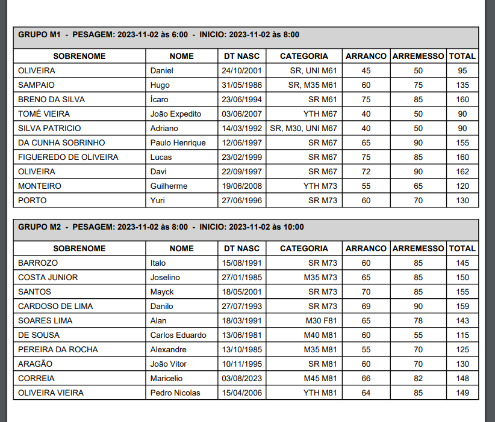

# Weightlifting Start Lists Automator
##### Version 0.1.1
##### Author - Leo Amora Sousa
### Video Demo: <https://www.youtube.com/watch?v=Tt5NK8JmcGs>
> This project arrange start lists for any olympic weightlifting competition.

Main objective of this program is set as many Start Lists as necessary based on a .CSV file (containing data from a Google Form) with athletes subscriptions of a particular competition and number of warm-up platforms are avalible at event.

## Project Overview
Weightlifing Automate Start Lists is a Python-based program that provides a creation of three .PDF files with Start Lists from <b>kids athletes</b>, <b>males athletes</b> and <b>females athletes</b>, with their respectives dates and time of each start list.

For this version, we got a pre-filled .CSV file with subscription from 3rd WL Championship from Ceara State in Brazil, so we got informations based on these datas:
- Carimbo de data/hora
- Endereço de e-mail
- Nome
- Sobrenome
- Data de nascimento
- Sexo
- @Instagram
- Número de filiação - FELPCE
- Categoria de Peso
- Categoria de Idade
- Arranco Inicial
- Arremesso Inicial
- Nome do treinador
- @Instagram do Treinador
- @Instagram local de treino
- Comprovante de pagamento da inscrição PIX: CNPJ: 43.495.515/0001-12
- Declaração de presença para atletas filiação social
- Comprovante de filiação FUCE
- Foto - tamanho story 9x16

When calling project, it's important set the warm-up platforms avalible as argument at terminal
- `argv[1]`: number of warm-up platforms avalible
> <i>This is because the number of athletes in each start list, depends how many platforms is avalible in warm-up area</i>

## Release History

* 0.1.1
    * FIX: style tables created from `generate_pdf_start_lists()`
* 0.1.0
    * The first proper release
* 0.0.1
    * Work in progress

## Contact
Leo Amora – leoamora94@gmail.com
